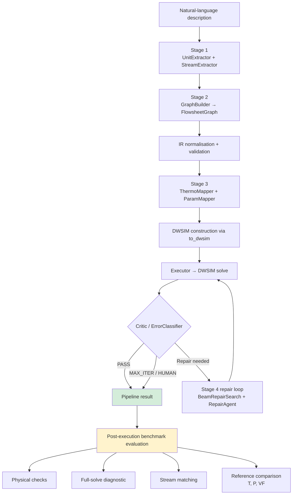

# ChatPSE

ChatPSE translates natural-language descriptions of steady-state chemical processes into executable DWSIM flowsheets. Given a plain-English process description, the pipeline extracts compound identities and unit operations, assembles a typed intermediate representation (IR), configures thermodynamic packages and operating conditions, constructs and solves the flowsheet inside DWSIM via a .NET automation interface, and applies classified repair where the solver fails or returns physically inconsistent results.

This repository accompanies an MSc thesis and associated manuscript. It contains research software and should be treated as such.

---

## Project status

- **Reported results branch:** `v4` (also merged to `main`)
- **Reported results commit:** `[FULL COMMIT HASH]` — see release checklist
- **Release tag:** `[THESIS RELEASE TAG]` — to be created on final submission
- **Archive DOI:** `[ARCHIVE DOI]` — to be added after Zenodo/institutional deposit
- The `main` branch may receive further development changes after the thesis release tag is created.
- No software licence has yet been assigned. The repository may be viewed, but public availability should not be interpreted as permission to reuse, modify, or redistribute the code.

---

## What the pipeline does

```
Natural-language description
  → Stage 1  compound and unit-operation extraction
  → Stage 2  typed intermediate representation (IR) assembly
  → Stage 3  thermodynamic configuration and operating-condition mapping
  → DWSIM construction and execution
  → Stage 4  classified repair loop
  → benchmark evaluation (separate from the pipeline outcome)
```

Several stages combine deterministic operations with language-model fallback, although simulator execution, schema validation, and a number of normalisation and evaluation procedures are entirely deterministic. For example, compound-name normalisation resolves most names by dictionary lookup before invoking an LLM; thermodynamic package selection applies rule-based family classification before optionally falling back to an LLM; the repair agent exhausts deterministic strategies before requesting an LLM-generated candidate value.

---

## Architecture

### Execution paths

Benchmark requests enter through `BenchmarkRunner` (`benchmark/runner.py`), which instantiates `OrchestratorV2` (`agents/orchestrator_v2.py`). When `USE_LANGGRAPH=1` is set, `OrchestratorV2` delegates to `GraphPipeline` (`agents/graph_pipeline.py`), a LangGraph `StateGraph` wrapping the same agent calls.

The headline capability and validation results reported in the thesis use the LangGraph-based `GraphPipeline` and reference-blind best-of-five selection. A separate earlier component-ablation experiment on the 20 capability cases used direct `OrchestratorV2`, `N=1` and a six-iteration ceiling. Its results are not combined with the headline benchmark aggregate.



**PASS** means the DWSIM solver converged and the critic returned no failure code for that iteration. Reference comparison and physical verification are evaluated separately in the post-execution benchmark step (see [Evaluation protocol](#evaluation-protocol)).

### Stage 4 repair detail

The repair loop uses `BeamRepairSearch` (`agents/stage4/beam_search.py`) for multi-error cases, with `RepairAgent` (`agents/stage4/repair_agent.py`) handling single-error paths. Deterministic repairs (BIP injection, unit-conversion, topology correction, parameter defaults, port reassignment) are attempted before any LLM candidate is generated. The `FailureRuleStore` (`agents/rule_store.py`) records repeated applied corrections and can synthesise rules from their stored values. These records are not filtered according to whether the originating run ultimately converged or passed. Depending on runner configuration, the store may persist across cases within a run.

---

## Repository structure

```
agents/
  basis.py                  — compound-name normalisation (two-stage: lookup then LLM)
  calibration.py            — BIP injection from corpus (no LLM)
  critic.py                 — failure detection and routing-code assignment
  executor.py               — DWSIM automation calls (runs inside container)
  graph_pipeline.py         — LangGraph StateGraph wrapping OrchestratorV2 stages
  orchestrator_v2.py        — pipeline controller; delegates to GraphPipeline when USE_LANGGRAPH=1
  rule_store.py             — failure-pattern memory (FailureRuleStore)
  stage1/                   — unit and stream extraction from natural language
  stage2/                   — IR assembly (GraphBuilder)
  stage3/                   — thermo configuration and parameter mapping
  stage4/                   — error classification and repair (BeamRepairSearch, RepairAgent)

ir/
  graph.py                  — FlowsheetGraph, typed NodeIR hierarchy, port specifications
  types.py                  — ErrorType, RepairStrategy, SimError (enums, shared across pipeline)
  normalise.py              — deterministic topology repair
  validate.py               — three-level IR validation → ValidationReport
  coupling.py               — ParameterCouplingMap (inter-unit parameter boosting)
  thermo_estimation.py      — bubble-point estimator and boiling-point utilities
  to_dwsim.py               — IR → DWSIM JSON serialisation
  repair.py                 — deterministic repair strategies

benchmark/
  runner.py                 — BenchmarkRunner (entry point for all benchmark runs)
  cases/                    — JSON case files grouped by tier
    capability.json         — 13-case capability tier (P·, F·, S·, C·, M· cases)
    easy.json, sanity.json, generalisation.json — development tiers
    val_l0.json             — validation L0 (objective + unit sequence only)
    val_l1.json             — validation L1 (full connectivity, no operating info)
    val_specified.json      — VALS_01 (fully specified variant of VAL_01)
  reference_flowsheets/     — per-case reference JSON (capability + validation tiers)
    PROVENANCE.md           — reference construction documentation
  reference_flowsheets_v2/  — promoted validation-tier references (VAL_01–10)
  physics_eval.py           — post-execution physical checks and reference comparison
  stream_matcher.py         — composition-anchored stream matching (Hungarian assignment)
  best_of_n.py              — reference-blind best-of-N candidate selection
  logger.py                 — per-run JSON record construction (RunLog, IterationLog)
  aggregate_per_run.py      — recalculate aggregate metrics from archived per-run JSONs
  ablation.py               — ablation configuration definitions and patching

rag/
  retriever.py              — BIPRetriever, ThermoRetriever, UnitSpecRetriever (no LLM)
  sources/
    binary_parameters.json  — 211-pair BIP corpus (173 NRTL, 38 UNIQUAC)
    compound_synonyms.json  — compound alias → DWSIM canonical name
    thermo_models.json      — property package selection rules

context/
  dwsim_knowledge.md        — DWSIM parameter reference, injected into LLM prompts
  failure_taxonomy.md       — failure codes, routing decisions, repair patterns

docker/
  Dockerfile                — container definition (Ubuntu 20.04, Python 3.9, .NET 8, DWSIM 9.0.4)

benchmark_runner.py         — top-level CLI for all benchmark and ablation runs
run_ablation_cap20.py       — 20-case capability component ablation (OrchestratorV2, N=1, max-iter=6)
run_component_ablation_val_hpc.sh  — PBS job: targeted validation component ablation (N=5, max-iter=15)
run_density_l1_hpc.sh       — PBS job: specification-density L1 runs
verify_ablation_counters.py — offline test that ablation instrumentation counters fire correctly
sitecustomize.py            — sets PYTHONNET_RUNTIME=coreclr on import
requirements.txt            — Python dependencies
```

> The `results_hpc/` directory containing per-run JSON records and the full console log is not tracked in this repository. Archived records are available from `[ARCHIVE DOI]`.

---

## Requirements

### Recalculating metrics from archived records

Only the Python standard library plus `networkx`, `scipy`, and `numpy` are required. No container, DWSIM installation, or model inference is needed.

```bash
pip install networkx scipy numpy
```

### Re-running the complete pipeline

| Requirement | Version used | Notes |
|---|---|---|
| Operating system | Ubuntu 20.04 | Via Docker or Singularity container |
| Python | 3.9 | Inside the container |
| .NET runtime | 8.0 | Inside the container |
| DWSIM | 9.0.4 (amd64) | Installed from `.deb` inside the container |
| pythonnet | ≥ 3.0.1 | Python↔.NET bridge |
| Ollama | Not archived | See known limitations |
| Model | qwen3:30b-a3b | Loaded by Ollama |
| GPU | L40S used on CX3 | A GPU with sufficient memory for the selected Ollama distribution is recommended for practical inference. Exact requirements depend on the model quantisation and serving configuration. |
| Cluster | Imperial College London CX3 (PBS) | HPC scripts are CX3-specific |
| Container runtime | Singularity/Apptainer | For HPC; Docker for local development |

The supplied `requirements.txt` lists direct dependencies but is not a fully pinned lock file.

---

## Language models

The reported experiments use **qwen3:30b-a3b**, an open-weight mixture-of-experts model served locally via Ollama. The deployed model was not selected through an exhaustive model benchmark. A targeted substitution study subsequently compared it with `qwen3:32b`, `deepseek-r1:32b`, `gemma3:27b`, and `mistral-small3.2:24b` on three L1 cases. This study tests sensitivity to model substitution but does not isolate architecture because training, post-training, and model family also vary.

Official model cards:
- [Qwen3-30B-A3B](https://huggingface.co/Qwen/Qwen3-30B-A3B)
- [Qwen3-32B](https://huggingface.co/Qwen/Qwen3-32B)
- [DeepSeek-R1-Distill-Qwen-32B](https://huggingface.co/deepseek-ai/DeepSeek-R1-Distill-Qwen-32B)
- [Gemma 3 27B](https://huggingface.co/google/gemma-3-27b-it)
- [Mistral Small 3.2](https://huggingface.co/mistralai/Mistral-Small-3.2-24B-Instruct-2506)

- **Ollama tag:** `qwen3:30b-a3b`
- **Model digest:** `[DIGEST — add to release checklist]`
- **Ollama version:** `[VERSION — add to release checklist]`

The `agents/llm.py` module also supports `anthropic`, `openai`, and `google-genai` providers. These were used during development and are not the model used for the reported benchmark results.

---

## Installation

### 1. Clone the repository

```bash
git clone https://github.com/hbadland/multiAgentFlowsheet.git
cd multiAgentFlowsheet
```

### 2. Create a Python environment (host, for metrics recalculation only)

```bash
python3.9 -m venv .venv
source .venv/bin/activate
pip install -r requirements.txt
```

### 3. Build or obtain the DWSIM container

The `Dockerfile` requires the DWSIM 9.0.4 `.deb` package placed at `docker/dwsim_9.0.4-amd64.deb` before building (excluded from the repository by `.gitignore`).

```bash
docker build \
    -f docker/Dockerfile \
    -t chatpse:latest \
    .
```

For HPC, convert the Docker image to a Singularity image:

```bash
singularity build dwsim.sif docker-daemon://chatpse:latest
```

> The PBS scripts assume the Singularity image is at `~/dwsim.sif`. Adjust `SINGULARITY_IMG` in the scripts to match your environment.

### 4. Install and start Ollama

Download Ollama from [https://ollama.com](https://ollama.com). The exact Ollama version used for the reported experiments was not archived.

### 5. Pull the required model

```bash
ollama pull qwen3:30b-a3b
```

### 6. Set required environment variables

```bash
export PYTHONNET_RUNTIME=coreclr
export OLLAMA_BASE_URL=http://host.docker.internal:11434/v1
export USE_LANGGRAPH=1
export BEST_OF_N=5
```

For HPC runs via Singularity, these are set inside the PBS scripts.

---

## Quick start

Inside the Docker container (or an equivalent environment with DWSIM and Ollama available):

```bash
PYTHONPATH=. \
USE_LANGGRAPH=1 \
BEST_OF_N=1 \
OLLAMA_BASE_URL=http://host.docker.internal:11434/v1 \
PYTHONNET_RUNTIME=coreclr \
python3.9 benchmark_runner.py \
    --case EASY_01 \
    --mode full_ccs \
    --model qwen3:30b-a3b \
    --max-iter 6
```

`BEST_OF_N=1` runs a single sample. The reported experiments used `BEST_OF_N=5`.

**Per-run JSON location:** `results/per_run/EASY_01_full_ccs_qwen3_30b-a3b_<timestamp>.json`

Key fields in the per-run JSON: `case_id`, `ablation_mode`, `model`, `timestamp`, `outcome` (`PASS` / `MAX_ITER` / failure code), `iterations` (per-iteration changes and errors), `system_streams` (DWSIM stream conditions), `ir_report_json`, `ablation_stats` (bubble-point and coupling counters, present only in instrumented runs). Note that `final_graph_summary` is a summary of the graph state at termination, not a complete serialised flowsheet; the record is not sufficient to replay the exact DWSIM execution.

---

## Running benchmark cases

### Key options

| Option | Effect |
|---|---|
| `--model MODEL` | LLM model name passed to Ollama (default: `qwen3:30b-a3b`) |
| `--mode MODE` | `full_ccs`, `no_physics`, `no_rule_store`, `no_coupling`, `greedy` |
| `--max-iter N` | Stage 4 repair loop ceiling per case |
| `--case CASE` | Single case by ID |
| `--case-files FILE...` | Load cases from specific JSON files, bypassing the tier system |
| `--no-save-logs` | Skip writing per-run JSON records |

`USE_LANGGRAPH=1` and `BEST_OF_N=N` are environment variables, not CLI flags.

### Single case

```bash
PYTHONPATH=. USE_LANGGRAPH=1 BEST_OF_N=5 \
OLLAMA_BASE_URL=http://localhost:11434/v1 \
PYTHONNET_RUNTIME=coreclr \
python3.9 benchmark_runner.py \
    --case VAL_06 \
    --mode full_ccs \
    --model qwen3:30b-a3b \
    --max-iter 15
```

### PBS batch job (HPC)

The committed PBS scripts are written for the Imperial College CX3 cluster (PBS scheduler, Singularity, `/rds` storage). They require adaptation to other HPC environments.

> **Warning:** `run_component_ablation_val_hpc.sh` requests a GPU node and runs multiple 5-sample sequences. Do not submit without understanding the walltime and resource cost.

---

## Evaluation protocol

### Pipeline evaluation (per-iteration, in-loop)

At the end of each DWSIM solve, the `ErrorClassifier` classifies any failure signals and the `CriticAgent` assigns a routing code. **PASS** records that the DWSIM solver converged and the critic found no error. It does not imply that the produced flowsheet is physically correct, that stream conditions agree with the reference, or that the full-solve diagnostic passes. Reference comparison and physical verification are evaluated separately.

### Post-execution benchmark evaluation

**Physical checks** (`benchmark/physics_eval.py`): case-specific checks on unit-type presence, thermodynamic package class, temperature and pressure monotonicity, outlet temperature ranges, two-phase separation quality, mass balance, and flash vapour fraction. Classified as CRITICAL, WARNING, or INFO.

**Full-solve diagnostic** (`benchmark/solve_status.py`): checks whether any non-feed stream retains the unresolved default signature used by the executor. It includes an exception for outputs whose specified temperature legitimately coincides with the default value. The diagnostic does not establish physical correctness and does not reject every zero-flow stream.

**Stream matching** (`benchmark/stream_matcher.py`): matches system stream tags to reference stream tags by composition-vector cosine similarity, with temperature, pressure, and vapour-fraction agreement as tiebreakers. Assignment is performed globally (Hungarian algorithm). Pairs below a confidence threshold (0.55) are left unmatched.

**Reference comparison** (`benchmark/physics_eval.py`): requires at least 3 matched streams, or at least 2 matches covering 80% or more of the reference streams, to report MAPE. Primary criteria:
- Temperature: within ±5 K absolute — CRITICAL
- Pressure: within ±5% relative — CRITICAL
- Vapour fraction: within ±0.05 absolute — WARNING (non-gating)

Reference flowsheets are separately constructed DWSIM simulations prepared within the same research project, not experimental ground truth. Because the generated and reference flowsheets are solved within the same DWSIM environment, the comparison measures reconstruction fidelity within that simulator. It does not validate the selected property models against experimental data. Some reference-validity determinations were made manually; see `benchmark/reference_flowsheets/PROVENANCE.md`.

### Best-of-N selection

When `BEST_OF_N=5`, five candidate samples are ranked reference-blind: (1) solve tier (`fully_solved` > `partial_solve` > `failed`), (2) `PASS` outcome then fewest CRITICAL IR errors, (3) fewest repair iterations. See `benchmark/best_of_n.py`.

---

## Reproducing the reported results

### Inspecting the archived records

```bash
# Inventory: prints date ranges and run counts
PYTHONPATH=. python3.9 benchmark/aggregate_per_run.py

# Filtered view
PYTHONPATH=. python3.9 benchmark/aggregate_per_run.py \
    --since 20260810 \
    --model qwen3:30b-a3b \
    --out results/aggregate_summary.json
```

The date-filtered command reconstructs a coherent result set for inspection, but it is not an immutable specification of the manuscript dataset. The script selects the most recent eligible record after the cutoff; if later runs exist in the archive they may be selected instead of the thesis runs. Exact recalculation of the published tables requires the final result manifest, which lists every selected record explicitly.

The manifest should be deposited at `results/manifests/thesis_2026.json`. If the aggregation script does not yet accept a `--manifest` flag, adding that capability would be more reproducible than relying on a date cutoff.

> Per-run records identify cases, models, timestamps, and outcomes, but do not embed a git SHA. Development runs and final selected runs may coexist in the archive.

### Repeating inference and simulation

Requires in addition:
- The exact `qwen3:30b-a3b` model artefact identified by digest (see release checklist)
- The Ollama version used on CX3 (see release checklist)
- The Singularity container built from `docker/Dockerfile` with DWSIM 9.0.4
- Configuration per experimental group:
  - Main capability and validation panel: `USE_LANGGRAPH=1`, `BEST_OF_N=5`, initial `--max-iter 6`, with conditional beam extension to 15 for multi-error `CONDITION_FIX` cases
  - L1 density runs and targeted validation component ablation: `USE_LANGGRAPH=1`, `BEST_OF_N=5`, explicit `--max-iter 15`
  - Earlier capability component ablation: `USE_LANGGRAPH` unset, single-execution sampling, `--max-iter 6`
- Rule store cleared before each case-mode pair in component ablation runs
- `OLLAMA_NUM_CTX=16384` as set in `run_component_ablation_val_hpc.sh`

---

## Experimental groups

### Development cases

Sanity, easy, and generalisation tiers were used during development and calibration. Results on these tiers are not the primary reported outcomes.

### 20-case capability benchmark

Thirteen capability cases (P1–P3, F1–F4, S1–S2, C1–C3, M1) plus three easy cases (EASY\_01, EASY\_02, EASY\_04), two sanity cases (SAN\_03, SAN\_04), and two generalisation cases (GEN\_01, GEN\_03). All 20 have separately constructed DWSIM reference flowsheets documented in `benchmark/reference_flowsheets/PROVENANCE.md`. **Headline results** use `GraphPipeline` (`USE_LANGGRAPH=1`), `BEST_OF_N=5`, and an initial six-iteration ceiling. Cases with more than one simultaneous `CONDITION_FIX` error may trigger beam search and extend the effective ceiling to fifteen iterations.

### Eleven-case validation benchmark (VAL\_01–VAL\_10, FOS\_01)

The validation benchmark comprises eleven cases. The reported ten-case validation panel covers VAL\_01 through VAL\_10. `FOS_01` (a case adapted from the FOSSEE process-simulation repository) is part of the repository validation collection but was not included in the dated result panel from which the manuscript aggregate was calculated. Its exclusion means the reported ten-case aggregate should not be interpreted as covering the complete eleven-case collection.

### Specification-density study

`VAL_01`, `VAL_03`, and `VAL_04` were evaluated at three levels: L0 states the process objective and broad functional sequence; L1 adds the complete unit sequence and connectivity while withholding operating conditions; and L2 adds the operating and thermodynamic information available for the case. The L1 inputs are stored in `benchmark/cases/val_l1.json`, while `benchmark/cases/val_specified.json` contains `VALS_01`, `VALS_03`, and `VALS_04`.

### Targeted validation component ablation

The matched ablation covers `VAL_01_L1`, `VAL_03_L1`, `VAL_04_L1`, `VAL_05`, and `VAL_06`. The three L1 cases span a passing execution, an iteration-limited failure, and an invalid intermediate representation, while `VAL_05` and `VAL_06` were selected as repair-stall cases.

The study removes the bubble-point estimator and parameter-coupling map independently, using five reference-blind samples per case and configuration. Neither removal changes the recorded outcome or repair trajectory. Instrumentation shows that this is exposure-limited: bubble-point calculations in `VAL_06` are called but produce no actionable repair candidate, the coupling map is never queried, and several cases terminate before either component can intervene. The result therefore does not show that either component is generally ineffective.

`no_physics` disables `bubble_point_K` (returns `None`); `no_coupling` disables `ParameterCouplingMap.get_coupled_boosts` (returns `{}`). The instrumentation is verified offline by `verify_ablation_counters.py` and at job start in `run_component_ablation_val_hpc.sh`.

### Earlier capability component ablation

`run_ablation_cap20.py` runs all 20 capability cases through four configurations (`full_ccs`, `no_rule_store`, `no_physics`, `no_coupling`) with `OrchestratorV2` (no `USE_LANGGRAPH`), single execution per case, and `--max-iter 6`. Results from this earlier study are not combined with the headline benchmark aggregate.

---

## Data products

Per-run JSON records are written to `results/per_run/<case_id>_<mode>_<model_slug>_<timestamp>.json`. The `ablation_stats` field (bubble-point call counts, coupling query counts) is present only in runs produced with the instrumented code version. Complete graph snapshots for every repair iteration are not retained; the record is not sufficient to replay the exact DWSIM execution.

Full pipeline output is captured by the PBS scripts. The `full_panel_v3.log` (archived console log for the main 31-case panel run) is available from `[ARCHIVE DOI]`.

---

## Known limitations

- **Dependencies not fully pinned.** `requirements.txt` lists direct dependencies without version pins. The exact environment cannot be reconstructed from this file alone.
- **Ollama version and model digest unarchived.** A different Ollama version may produce different tokenisation or context behaviour. Future pulls of the same tag are not guaranteed to retrieve the same model weights.
- **Archived records are not immutably tagged.** Development runs and final selected runs coexist. The date-filtered aggregation is approximate; the final result manifest is the authoritative record.
- **Reference flowsheets are not experimental ground truth.** They are separately constructed DWSIM simulations prepared within the same research project. Agreement measures reconstruction fidelity within DWSIM, not physical correctness relative to experimental data.
- **Complete graph snapshots not retained.** Per-run records contain a final graph summary. Exact replay of the DWSIM execution is not possible from the record.
- **HPC scripts are CX3-specific.** The PBS scripts contain hard-coded paths, scheduler directives, and GPU type assumptions specific to Imperial College London's CX3 facility.
- **Rule-store state not archived.** Its state is not persisted in per-run JSON records.

---

## Supporting information and research data

| Item | Location |
|---|---|
| Supporting Information document | `[LINK]` |
| Final result manifest | `results/manifests/thesis_2026.json` — `[LINK]` |
| Benchmark reference provenance | [`benchmark/reference_flowsheets/PROVENANCE.md`](benchmark/reference_flowsheets/PROVENANCE.md) |
| Complete LLM prompts | `[LINK]` |
| Additional results tables | `[LINK]` |
| Research Data Management Statement | `[LINK]` |
| Archived release | `[ARCHIVE DOI]` |

---

## Citation

```bibtex
@mastersthesis{badland2026chatpse,
  author = {Badland, Harry},
  title  = {[THESIS TITLE]},
  school = {Imperial College London},
  year   = {2026},
  note   = {[THESIS URL OR HANDLE]}
}
```

```bibtex
@software{badland2026chatpse_software,
  author  = {Badland, Harry},
  title   = {ChatPSE: multi-agent chemical flowsheet generation},
  year    = {2026},
  doi     = {[ARCHIVE DOI]},
  url     = {https://github.com/hbadland/multiAgentFlowsheet}
}
```

---

## Licence

No software licence has yet been assigned. The repository may be viewed, but public availability should not be interpreted as permission to reuse, modify, or redistribute the code.

---

## Contact

- GitHub: [@hbadland](https://github.com/hbadland)
- Institutional email: hgb25@ic.ac.uk

---

## Release checklist

- [ ] Finalise thesis title and add to BibTeX entry
- [ ] Record full commit hash for reported results and insert above
- [ ] Create immutable release tag (`[THESIS RELEASE TAG]`) at the reported commit
- [ ] Archive release and obtain DOI (Zenodo or institutional repository)
- [ ] Add software licence file (`LICENSE`)
- [ ] Record Ollama version used on CX3 — if not recoverable from scheduler logs or archived manifests, mark as **permanently unrecorded** rather than substituting the current installed version
- [ ] Record `qwen3:30b-a3b` model digest (SHA256 of GGUF artefact) — same caveat: only record if historically verifiable
- [ ] Deposit final result manifest at `results/manifests/thesis_2026.json`
- [ ] Add `--manifest` flag to `benchmark/aggregate_per_run.py` for manifest-based recalculation
- [ ] Link Supporting Information document and additional results tables
- [ ] Link or upload complete LLM prompts
- [ ] Confirm archive contains full console log (`full_panel_v3.log`)
- [ ] Test clean-environment quick start (fresh clone, no pre-existing results)
