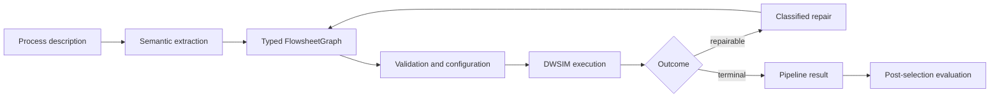

# ChatPSE

**Natural-language process descriptions in. Executable DWSIM flowsheets out.**

[](#requirements)
[](https://dwsim.org/)
[](LICENSE)
[](ChatPSE_thesis_data/DATA_LICENSE.md)
[](#limitations)

[Quick start](#quick-start) · [Results](#results) · [Research data](ChatPSE_thesis_data) · [How it works](#how-it-works)

</div>

ChatPSE turns plain-English descriptions of steady-state chemical processes into
typed process graphs, translates them into DWSIM, runs the simulation, and attempts
targeted repair when execution fails.

The project was built for an Imperial College London MSc research project. It is
research software rather than a production process-design tool.

## Why ChatPSE?

A flowsheet that converges is not necessarily the flowsheet that was described.
ChatPSE therefore reports two things separately:

- whether the generated simulation executed successfully; and
- whether its matched stream conditions agree with an independently constructed
  DWSIM reference.

That distinction is the main idea behind the project. A pipeline `PASS` means DWSIM
converged without a recognised in-loop failure. It does **not** by itself establish
physical correctness or reference agreement.

## Results

| Benchmark | Pipeline PASS | Fully solved | Reference agreement |
|---|---:|---:|---:|
| Compact capability cases | 20/20 | 20/20 | 20/20 eligible cases passed |
| Literature-derived validation cases | 1/10 | 3/10 | 0/2 eligible cases passed |

The capability suite contains compact, well-specified processes. The validation
suite is larger and deliberately requires more topology and operating information
to be inferred. Four capability cases also retained warning-level vapour-fraction
differences despite meeting the temperature and pressure criteria.

Selected records, manifests, redacted logs, environment metadata, and derived
tables are in [`ChatPSE_thesis_data`](ChatPSE_thesis_data). The deposit explains
which runs were included and which were excluded.

## How it works



1. `BasisAgent`, `UnitExtractor`, and `StreamExtractor` recover compounds, units,
   and connections from the description.
2. `GraphBuilder` assembles a typed `FlowsheetGraph`. Deterministic checks validate
   ports, connectivity, required parameters, phase assumptions, and cycles.
3. `ThermoMapper` and `ParamMapper` assign a property package and operating
   conditions. Binary interaction parameters come from the local corpus where
   complete coverage is available.
4. The graph is serialised through the DWSIM .NET interface and solved.
5. Recognised failures are routed to bounded topology, parameter, thermodynamic,
   or condition repair. Every patched graph is revalidated before another solve.
6. Benchmark evaluation happens after reference-blind candidate selection.

Most stages combine deterministic logic with constrained model calls. Schema
validation, graph normalisation, DWSIM execution, and benchmark scoring are
deterministic.

## Quick start

### Inspect the released results

No DWSIM installation or model inference is needed to inspect the archived JSON
records:

```bash
git clone https://github.com/hbadland/multiAgentFlowsheet.git
cd multiAgentFlowsheet
python3.9 -m venv .venv
source .venv/bin/activate
pip install networkx scipy numpy
PYTHONPATH=. python3.9 benchmark/aggregate_per_run.py \
    --per-run-dir ChatPSE_thesis_data/capability
```

The curated dataset has its own [README](ChatPSE_thesis_data/README.md),
[`MANIFEST.json`](ChatPSE_thesis_data/MANIFEST.json), and
[`SHA256SUMS`](ChatPSE_thesis_data/SHA256SUMS).

### Run a flowsheet case

Full execution requires DWSIM 9.0.4, .NET 8, Python 3.9, and an Ollama-served
model. Build the supplied container after placing the DWSIM 9.0.4 Debian package
at `docker/dwsim_9.0.4-amd64.deb`:

```bash
docker build -f docker/Dockerfile -t chatpse:latest .
ollama pull qwen3:30b-a3b
```

Inside the container, or an equivalent environment:

```bash
PYTHONPATH=. \
USE_LANGGRAPH=1 \
BEST_OF_N=1 \
OLLAMA_BASE_URL=http://host.docker.internal:11434/v1 \
PYTHONNET_RUNTIME=coreclr \
python3.9 benchmark_runner.py \
    --case EASY_01 \
    --mode full_ccs \
    --model qwen3:30b-a3b \
    --max-iter 6
```

Set `BEST_OF_N=5` to use the reference-blind five-candidate selection procedure
used for the reported headline benchmarks.

## Requirements

| Component | Reported environment |
|---|---|
| OS | Ubuntu 20.04 container |
| Python | 3.9 |
| .NET | 8.0 |
| DWSIM | 9.0.4 amd64 |
| Ollama | 0.24.0 |
| Baseline model | `qwen3:30b-a3b` |
| HPC runtime | Singularity/Apptainer on Imperial CX3 |

The Python requirements file lists direct dependencies but is not a fully pinned
lock file. The HPC scripts contain site-specific scheduler settings and paths.

<details>
<summary><strong>Recorded model and environment identifiers</strong></summary>

- Ollama tag: `qwen3:30b-a3b`
- Ollama manifest digest: `ad815644918f0eaab341c12b67837cc6dd4562342cdaf118f83d5d554cb37226`
- Executed model blob SHA256: `58574f2e94b99fb9e4391408b57e5aeaaaec10f6384e9a699fc2cb43a5c8eabf`
- Ollama version: `0.24.0`
- DWSIM version: `9.0.4`

The model-substitution study also used `qwen3:32b`, `deepseek-r1:32b`,
`gemma3:27b`, and `mistral-small3.2:24b`. It was a targeted sensitivity check,
not a general model ranking.

</details>

## Evaluation in brief

Five generated candidates are ranked without access to reference values. Ranking
prefers a fully solved candidate, then pipeline `PASS`, fewer critical IR errors,
and fewer repair iterations.

Accepted generated/reference stream pairs are assigned globally using composition
as the main signal, with temperature, pressure, vapour fraction, feed identity,
and topology as secondary evidence. Numerical comparison requires at least three
matched streams, or two streams covering at least 80% of the reference.

- temperature: within 5 K of the reference;
- pressure: within 5% of the reference; and
- vapour fraction: difference no greater than 0.05, reported as a non-gating
  warning.

These are simulator-internal reconstruction checks. The references are separate
DWSIM flowsheets, not experimental ground truth.

## Repository map

| Path | Purpose |
|---|---|
| [`agents/`](agents) | extraction, configuration, execution routing, and repair |
| [`ir/`](ir) | typed graph, validation, normalisation, and DWSIM serialisation |
| [`benchmark/`](benchmark) | cases, references, matching, metrics, and aggregation |
| [`rag/`](rag) | compound aliases, property-package rules, and BIP data |
| [`docker/`](docker) | DWSIM container definition |
| [`ChatPSE_thesis_data/`](ChatPSE_thesis_data) | curated records underlying the reported results |
| [`docs/`](docs) | longer-form technical notes |

The root-level `benchmark_runner.py` is the main CLI. `demo.py` is the older
single-process demonstration path. Experiment and HPC helpers live under
[`scripts/`](scripts).

## Limitations

- The validation benchmark is small and the capability suite is not entirely
  held out from development.
- The stream-matching score uses temperature and pressure as secondary signals,
  so reported errors are conditional on the accepted matches.
- Reference flowsheets test reconstruction within DWSIM, not agreement with plant
  or experimental data.
- Dependencies are not fully pinned, complete graph snapshots were not retained
  at every repair iteration, and rule-store state is not embedded in each run.
- The repair loop can modify parameters and supported connections, but it cannot
  rebuild an accepted topology from scratch.

## Citation

```bibtex
@software{badland2026chatpse,
  author = {Badland, Harry},
  title  = {ChatPSE: A Simulation-in-the-Loop Multi-Agent System for
            Executable Flowsheet Generation},
  year   = {2026},
  url    = {https://github.com/hbadland/multiAgentFlowsheet}
}
```

## Licence

ChatPSE source code is available under the [MIT licence](LICENSE). Generated
research data in `ChatPSE_thesis_data` is released under
[CC BY 4.0](ChatPSE_thesis_data/DATA_LICENSE.md). FOSSEE-derived development files
retain CC BY-SA 4.0 terms; see [third-party notices](THIRD_PARTY_NOTICES.md).

---

Built by [Harry Badland](https://github.com/hbadland) at Imperial College London.
